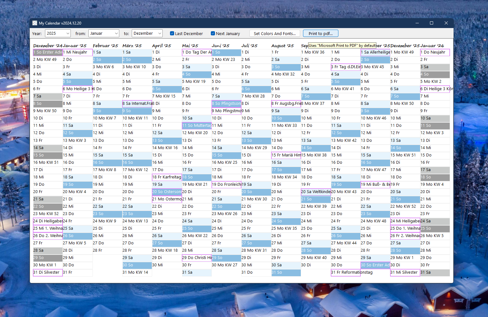

# Date_Calendar  
## Shows your personal calendar  

 

  
Start the interactive Calendar select the year, select the months to view, set colors and fonts to your liking, and print the calendar to pdf.  
Tipp:  
If your printer is capable of only DIN-A4 (or maybe DIN-A3) you can get DIN-A3 (DIN-A2) too, by dividing the calendar into 2 pieces and glue the pieces togehter after printing them.  
How to do it, do the following:  
1. select LastDecember, select month from January to June, and print to DIN-A4 (DIN-A3) in Portrait-format  
2. select NextJanuary, select month from July to December, and print to DIN-A4 (DIN-A3) in Portrait-format  
  
Or maybe you can print your pdfs in any size your printer is capable of.  

You also need the following:  
* Module MTime in Date_TimeConversion  
* Class ColorDialog in Win_Dialogs  
* Class FontDialog in Win_Dialogs  

